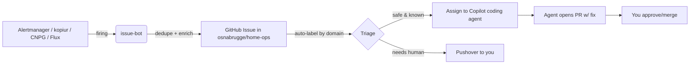

# Cluster Review & Strategic Backlog — 2026-07

> A fact-based, end-to-end review of the home-ops cluster: what's solid, what's
> fragile, and every worthwhile thing to set up / fix / improve — prioritized.
> This is the durable companion to [OPERATIONS-BACKLOG.md](OPERATIONS-BACKLOG.md).
> Owner intent: **the cluster should page an AI agent, not the human.** Issues
> should be auto-triaged and, where safe, auto-remediated by custom agents.

## 0. Fact base (measured 2026-07-16)

| Signal | Value |
|---|---|
| HelmReleases | 92 (all Ready) |
| Kustomizations | all Ready |
| HTTPRoutes (user-facing) | 52 |
| ServiceMonitors/PodMonitors | 63 |
| PrometheusRules | 49 |
| PVCs | 50 |
| kopiur SnapshotPolicies | 28 (snapshots Succeeded, ~daily) |
| kopiur repo | single `nas` (Filesystem backend on nas02) — **no off-site copy** |
| Postgres backups | ✅ NOW to Ceph RGW (fixed this session; was a 76-day gap) |
| Alert delivery | Pushover → **the human** (not an agent) |
| GitHub integration | Flux commit statuses only (no issue creation, no agent handoff) |

## 1. Done this session (2026-07-16)

- ✅ **Frigate** cameras live (go2rtc restream + Coral TPU, detect pinned 704×480).
- ✅ **Azure external synthetic monitoring** deployed to the (previously empty)
  `rg-homeops-prod`: App Insights standard tests probing the public surface from
  4 regions every 5m.
- ✅ **Spoolman data restored** — the 2026-07-07 SQLite→Postgres migration never
  imported the data; copied 3 vendors / 7 filaments / 7 spools / 4 settings across.
- ✅ **Postgres backups fixed** — deployed a Ceph RGW object store and wired CNPG
  barman backups (base + WAL, 30d, PITR). Closed the 76-day gap.

## 2. Highest-risk gaps (data loss & DR) — **P0**

The Spoolman incident was a symptom of a systemic pattern. Address the class, not
just the instance.

- [ ] **P0 — Off-site backup copy.** kopiur writes only to `nas` (nas02 filesystem).
  A NAS failure/ransomware event loses *both* live data and backups. Add a second
  kopiur `Repository`/replication target: **Azure Blob in rg-homeops-prod** (off-site)
  and/or the new **Ceph RGW** bucket (on-cluster, independent of nas02).
  Kopiur supports `RepositoryReplication` — use it.
- [ ] **P0 — App data that moved to Postgres is not covered by its PVC snapshot.**
  Spoolman/netbox/authelia/dispatcharr/diode/hydra live in `postgres16`; their
  kopiur PVC snapshots back up *uploads*, not the DB. Now covered by CNPG barman —
  **but validate a real restore** (spin a `Cluster` from the barman store into a
  scratch namespace and diff row counts). Backups you haven't restored aren't backups.
- [ ] **P0 — Stateful apps with NO backup at all:** `mosquitto` (home-automation
  broker state), `slskd` (config/db), `matter-server` (device pairings), `printstash`.
  Add the kopiur component (or exclude explicitly with a documented reason).
- [ ] **P1 — Backup monitoring & alerting.** Add PrometheusRules that fire when: a
  kopiur Snapshot fails, a policy hasn't produced a snapshot in >36h, or CNPG
  `lastSuccessfulBackup` is stale. Today a silent backup failure is invisible until
  you open the app (exactly the Spoolman failure mode).
- [ ] **P2 — Migration guardrail.** A CI check / policy that flags any app flipping
  DB backends (`*_DB_TYPE`, sqlite→postgres) without a data-import step.

## 3. Agent-first operations (the core vision) — **P0/P1**

Goal: *roll out of bed, look at an auto-filed issue, assign it to an agent, go back
to sleep.* Build this pipeline:

- [ ] **P0 — Route alerts to an issue-bot instead of (only) Pushover.** Add an
  Alertmanager webhook receiver → a small in-cluster service (or Cloudflare Worker)
  that opens/updates a GitHub issue per alert fingerprint (dedupe on `fingerprint`,
  auto-close on resolve). Reuse the existing `github-status` token/secret pattern.
- [ ] **P0 — Auto-assign issues to a Copilot coding agent** for well-understood,
  low-risk classes (pod crashloop with known fix, cert renewal, image update).
  GitHub supports assigning issues to the Copilot agent which raises a PR.
- [ ] **P1 — Custom domain agents** (this repo already has `flux-triage`,
  `ceph-rbd-recovery`, `volsync-restore` subagents). Wire the issue labels →
  the matching agent, and expand the roster: `cnpg-restore`, `cert-triage`,
  `capacity-planner`, `backup-auditor`.
- [ ] **P1 — Nightly autonomous audit.** A CronJob runs `scripts/health-sweep.sh`
  + a "desired-state diff" and files a single digest issue with anything off. This
  is the "notify the agent, not me" heartbeat.
- [ ] **P2 — Dead-man's switch.** A `buddy_heartbeat` (Gatus external endpoint
  already exists) so if the whole alert pipeline dies, *something outside* notices.

## 4. Observability & insights — **P1**

- [ ] **P1 — "Never accessed" report.** No usage telemetry exists per app. Add
  envoy access-log metrics (requests-per-route) into VictoriaLogs/Prometheus, then
  a Grafana panel + monthly issue listing routes with 0 external hits in 30d
  (candidates to retire and reclaim resources). You asked specifically for this.
- [ ] **P1 — SLO dashboards** for the public surface (availability now measured by
  the new Azure tests + in-cluster Gatus — unify them into one status view).
- [ ] **P1 — Unified alert routing policy** (severity → channel): P1/P2 → agent/issue,
  page-worthy → Pushover, info → digest only. Today routing is flat.
- [ ] **P2 — Trace/log correlation** for the media stack (arr apps ↔ download clients).

## 5. Security & auth — **P1**

- [ ] **P1 — Finish the auth auto-wiring** (LLDAP + FreeRADIUS + Authelia). Goal:
  bootstrapping the cluster auto-provisions users/groups/OIDC clients so app SSO
  "just works." (Already on the backlog; high leverage, currently manual.)
- [ ] **P1 — Secret hygiene audit.** Confirm every app pulls from AKV via
  ExternalSecret (no in-repo plaintext), and add expiry alerts for AKV secrets/certs.
- [ ] **P2 — Network policy baseline** for the `default` namespace (media apps are
  currently flat east-west).
- [ ] **P2 — Image provenance / digest pinning audit** across all 92 HRs.

## 6. Efficiency & resource optimization — **P1/P2**

- [ ] **P1 — Right-size requests/limits** from 7-day metrics (backlog item; 50 PVCs,
  92 workloads — likely significant over-provisioning in `default`).
- [ ] **P1 — zeroscaler coverage.** Scale-to-zero for rarely-used apps (tie to the
  "never accessed" report). Component already exists.
- [ ] **P2 — Ceph capacity is healthy** (5.75% of 5.5TiB). Reclaim orphaned PVCs
  in `lost+found`/old volumes; audit the 50 PVCs for unattached ones.

## 7. Finish the abandoned backlog — **P0/P1** (things that "fell off")

- [ ] **P0 — Mikrotik switch config** (`docs/mikrotik-switch-config.rsc`, started a
  month ago).
- [ ] **P0 — Omada Controller migration off nas02** into the cluster (app exists at
  `network/omada-controller`; DB at `database/omada-db`).
- [ ] **P1 — Netbox import + Diode** programmatic IPAM (stop hand-assigning IP/DNS/MAC).
- [ ] **P1 — Azure alerts → Pushover/agent** bridge (Azure action group has no
  receiver yet — fold into §3's issue-bot).
- [ ] **P1 — NAS02 dependency migration** (bazarr/plex/qbittorrent/radarr/sabnzbd/
  sonarr/slskd/… still reference `nas02.in.homeops.ca`).
- [ ] **P1 — New apps requested:** beets/lidarr (present), stash, whisparr, unpackerr.

## 8. Workflow improvements (for you *and* the agent) — **P2**

- [ ] **P2 — Single source of truth for tasks.** This doc + GitHub issues; the agent
  files/updates issues so nothing lives only in chat. (Fixes the "falls off the
  backlog" problem you raised.)
- [ ] **P2 — `just` recipes** for the common agent flows (reconcile, health-sweep,
  backup-verify, restore-test) so both you and agents invoke them identically.
- [ ] **P2 — Repo memory expansion** (Serena/agent memory) for per-app runbooks so
  recovery is one command, not archaeology.

---

## Prioritized execution order (recommended)

1. **P0 data-protection close-out:** restore-test CNPG barman; add off-site copy
   (Azure Blob); back up mosquitto/slskd/matter-server/printstash; backup-failure alerts.
2. **P0 agent-first pipeline:** Alertmanager → issue-bot → GitHub issue → Copilot
   agent assignment. This is the keystone that makes everything else self-sustaining.
3. **P0 abandoned items:** Mikrotik, Omada off nas02.
4. **P1:** never-accessed report, auth auto-wiring, right-sizing, Netbox/Diode.
5. **P2:** the rest.

_Next concrete step (pending your go-ahead): build §3's issue-bot + a CNPG restore
test, since together they turn "I discover breakage by accident" into "the cluster
files a triaged issue and an agent starts fixing it."_
