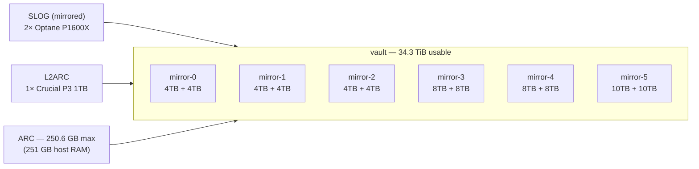

# nas01 — Storage Architecture

> Supersedes `NAS01-DESIGN-AND-MIGRATION.md`, which contained factual hardware
> errors and an inadequate dataset design. Corrections are itemised in §1.

---

## 1. Corrections to the previous document

| Previous claim | Verified reality | Evidence |
|---|---|---|
| "2× SATADOM-MV 3IE — mirrored `boot-pool`" | **`boot-pool` is a SINGLE device, `sdm3`. No redundancy.** | `zpool status boot-pool` shows only `sdm3` |
| Implied `sdn` was faulty/absent | **`sdn` is healthy.** SMART `PASSED`, 469 power-on hours, 1 power cycle, 0 reallocated sectors | `smartctl -H -A /dev/sdn` |
| No explanation why `sdn` was unused | **It holds a foreign importable pool `rpool`** (id `9167833229596516950`, vdev `sdn2`) — an old Proxmox root install | `zpool import` |
| "1× Crucial CT1000P3SSD8 for L2ARC" (stated without flagging) | Correct as-built, but **3 of the 4 drives are not in this machine at all** | see §3 |
| Dataset design covering only `vault`, `vault/kopiur`, `vault/netboot` | Inadequate — no SMB, NFS, Proxmox, app, or zvol provision | see §4 |
| fio-only, QD1, single-job benchmarks | Replaced with a multi-profile matrix at realistic queue depths | see §5 |

---

## 2. Verified hardware inventory

Collected directly from the host, not assumed.

### 2.1 Data disks — 12 × SAS/SATA behind an LSI SAS2308 HBA (`5e:00.0`)

| Dev | Size | Model | Serial |
|---|---|---|---|
| sda | 3.6T | ST4000NM017A | WS20WDJF |
| sdc | 3.6T | ST4000VN000-1H4168 | Z30150W6 |
| sdd | 3.6T | ST4000NM017A | WS20XVMB |
| sde | 3.6T | ST4000NM017A | WS20WDZS |
| sdg | 3.6T | ST4000VN000-1H4168 | Z30150XY |
| sdj | 3.6T | ST4000NM017A | WS20WEHL |
| sdb | 7.3T | ST8000VN004-2M2101 | WKD1EJX1 |
| sdf | 7.3T | ST8000VN0022-2EL112 | ZA18KM24 |
| sdh | 7.3T | ST8000VN004-2M2101 | WKD32J4N |
| sdl | 7.3T | ST8000VN0022-2EL112 | ZA18L3P5 |
| sdi | 9.1T | ST10000VE0008-2PQ103 | ZTN0YPF7 |
| sdk | 9.1T | ST10000VE0008-2PQ103 | ZTN0YP94 |

### 2.2 Boot devices — 2 × SATADOM

| Dev | Serial | State |
|---|---|---|
| sdm | 20170830AA112508450E | `boot-pool` — **single device, no mirror** |
| sdn | 20150203AAAA94508408 | **healthy but idle**; holds foreign `rpool` |

### 2.3 NVMe — only 3 devices exist on the PCI bus

| PCI | Dev | Size | Model | Role |
|---|---|---|---|---|
| `3b:00.0` | nvme0n1 | 110.3G | INTEL SSDPEK1A118GA (Optane P1600X) | SLOG (mirror leg) |
| `3c:00.0` | nvme2n1 | 110.3G | INTEL SSDPEK1A118GA (Optane P1600X) | SLOG (mirror leg) |
| `af:00.0` | nvme1n1 | 931.5G | Micron 2550 / **Crucial CT1000P3SSD8** | L2ARC (cache) |

### 2.4 Pool topology (`vault`)

6 × 2-way mirrors + mirrored SLOG + single L2ARC. 34.3 TiB available, **effectively empty (1.52 MB allocated)**.



---

## 3. Open hardware issues (require your decision)

### 3.1 The 3 "missing" Crucial CT1000P3SSD8 drives — CONFIRMED: bifurcation is off

#### Prior pool `testpool` — destroyed 2026-07-29, recorded here for the record

`vault` was not built on bare metal. It replaced `testpool`, which was destroyed
at `2026-07-29 12:51:09` via
`midclt call -j pool.export 1 '{"destroy": true, "cascade": true}'`.
**This was done by an AI agent session running as `sean-admin`.** Its topology:

| Property | Value |
|---|---|
| Capacity | 50.9 T raw / 38.1 T usable, ~317 G used |
| Data vdevs | 2 × **mismatched RAIDZ1** (6-wide + 4-wide) |
| SLOG | mirrored Intel Optane P1600X |
| **L2ARC** | **4 × Crucial P3 1 TB NVMe** |
| Datasets | `apps`, `data`, `home` (316 G), `ix-apps`, `.ix-virt` (incus VMs), `.system` |

> **The mistake to learn from:** `testpool` was recorded as having a **4-drive**
> L2ARC, but by then only **1** NVMe enumerated. That 3-drive discrepancy was not
> investigated before the pool was destroyed, so "1 cache device" was carried
> forward into `vault` as if it were normal — and then written into this document
> as "the drives were never here." Always reconcile recorded topology against
> live device enumeration *before* destroying a pool.


**They are physically installed.** All 4 sit on an M.2 carrier in `CPU2 SLOT 5`;
only the first one enumerates because BIOS PCIe bifurcation is not set to
`x4x4x4x4` for that slot. Diagnosis confirmed 2026-08-01:

```console
$ sudo lspci -vv -s ae:00.0 | grep -E "Physical Slot|LnkCap:|LnkSta:"
        Physical Slot: 0-5
        LnkCap: Port #5, Speed 8GT/s, Width x16        <-- slot is x16
        LnkSta: Speed 8GT/s, Width x4                  <-- only x4 trained
```

`dmidecode -t slot` reports `CPU2 SLOT 5 PCI-E 3.0 X16` as *In Use*. An x16 slot
training at x4 with a passive carrier means lanes 4–15 are idle and M.2 sockets
2–4 are invisible to the OS.

> **Do not test this by looking for "empty" PCIe bridges.** Without bifurcation
> the extra root ports do not enumerate at all, so there is nothing empty to find.
> Compare `LnkCap` width against `LnkSta` width instead.

Because only 1 drive was visible on `2026-07-29`, `zpool create vault` baked in a
**single `cache` device**. That is a consequence of the BIOS setting, not evidence
the other drives never existed.

**Fix (requires a reboot — schedule a window):** BIOS → Advanced → Chipset
Configuration → North Bridge → IIO Configuration → CPU2 Configuration → set the
IOU serving SLOT 5 to `x4x4x4x4`, then reboot and confirm 4 NVMe in
`/sys/class/nvme/`. No BMC/Redfish credentials are stored in this repo, so this is
currently a manual change via the Supermicro iKVM at `192.168.99.45`.

**Then decide placement — do NOT reflexively put all 4 in L2ARC** (see §3.3).

### 3.2 `boot-pool` has no redundancy

> ### ☠️ THE PREVIOUS FIX IN THIS SECTION WAS DELETED — IT WOULD NOW DESTROY DATA
>
> This section used to say `sdn` was "healthy and idle" and gave commands to
> `sgdisk --zap-all /dev/sdn` and attach it to `boot-pool`.
> **Device letters changed when TrueNAS was reinstalled (2026-08-04).**
> `sdn` is now a **live member of `vault` mirror-2**:
>
> ```console
> $ sudo blkid -s PARTUUID -o value /dev/sdn1
> 51b90283-4a0a-4618-926e-e974b47379f2      # <-- ONLINE in vault mirror-2
> ```
>
> Running the old commands today would wipe a mirror leg and degrade the pool.
> **Never target a bare `/dev/sdX` in this machine.** Always resolve by
> `PARTUUID`/serial and confirm against `zpool status -P` first.

**Verified state 2026-08-04** (`lsblk -d -o NAME,SIZE,TRAN,MODEL,SERIAL`):

| Device | Size | Transport | Model | Role |
|---|---|---|---|---|
| `sdl` | 59.6G | sata | SATADOM-MV 3IE | **`boot-pool` — single device, NO redundancy** |
| `sdm` | 0B | **usb** | BR25 UDISK | phantom / empty virtual media |
| `sdo` | 0B | **usb** | **PiKVM Flash Drive** (`CAFEBABE`) | PiKVM virtual media — **not a real disk** |
| `sda`–`sdk`, `sdn` | 3.6–9.1T | sas | Seagate | the 12 `vault` data disks |

There is now **only one SATADOM**. The second one referenced in the old inventory
(serial `20150203AAAA94508408`, described as holding a foreign `rpool`) is **no longer
present in the machine**.

**Consequences:**

- `boot-pool` redundancy **cannot** be fixed with existing hardware. It needs a
  **second physical SATADOM** — this justifies the eBay purchase, and it is the one
  hardware buy that fixes a real single point of failure today.
- **Do not** mirror `boot-pool` onto a USB device. `sdm`/`sdo` are 0-byte virtual
  media; PiKVM media disappears when the session detaches, which would break boot.
- Until a second SATADOM exists, mitigate by keeping a current TrueNAS **config
  backup** off-box — the pool survives a boot device failure, but the configuration
  does not (proven by the 2026-08-04 reinstall, which lost shares/users/tasks while
  `vault` imported cleanly).


### 3.3 Where the 4 NVMe should actually go — measured 2026-08-01

Once bifurcation is fixed you get 4 × 931 GB. Measurements taken while the pool
was still nearly empty (migration from nas02 incomplete):

| Metric | Value | Reading |
|---|---|---|
| Host RAM | 251 GB (242 GB **free**) | ARC is nowhere near pressured |
| ARC hit ratio | **97.3 %** (86.3M accesses) | working set already fits in RAM |
| L2ARC hit ratio | **13.5 %** (86.5 % miss) | cache is barely being used |
| L2ARC size | **4.3 MiB** | it holds essentially nothing |
| L2ARC I/O | 224.5 GiB written / 30.7 GiB read | ~7:1 write amplification for no gain |

A 97.3 % ARC hit rate with 242 GB of RAM free means L2ARC has nothing useful left
to serve; it is currently just consuming NVMe write endurance. Scaling it to 4
drives would also grow the in-RAM L2ARC headers, displacing real cached data.

> **Caveat — do not over-read this.** The pool is nearly empty and the
> nas02 → nas01 migration is unfinished, so this is not the steady-state workload.
> Re-measure with `arc_summary` after migration before committing.

**Preferred use on a 12-spindle mirror pool:** a **mirrored `special` vdev** for
metadata and small blocks. On spinning rust this transforms directory traversal
and small-file reads far more than L2ARC ever will.

> ⚠️ **A `special` vdev is part of the pool: if it dies, the pool dies.** It must
> be mirrored (2- or 3-way), never single. This is a bigger commitment than L2ARC,
> which is safely removable at any time.

Alternative: keep them out of `vault` entirely and build a separate NVMe pool for
VM/app workloads that genuinely need low latency.

---

## 4. Storage architecture

### 4.1 Design principles

1. **Recordsize follows workload**, never one global 128K — but chosen from
   **measurement, not folklore** (§5.5). On this spinning-disk pool the popular
   "use 16K for databases" rule is actively harmful.
2. **ACL type follows protocol.** SMB needs NFSv4 ACLs; POSIX ACLs cannot express them.
3. **Create-time-only properties must be right now**, while the pool is empty (§4.2).
4. **One dataset per policy boundary** — snapshots, quotas, replication and share
   permissions are all per-dataset.
5. **No deduplication** (§4.5).
6. **Explicit landing zone for unforeseen workloads** so they don't get dumped into
   a badly-tuned dataset by default (§4.3, `vault/scratch`).

### 4.2 Properties that CANNOT be changed after creation

This is the single most important reason to restructure now rather than later:

| Property | Why it matters |
|---|---|
| `casesensitivity` | **Must be `insensitive` for SMB.** Windows/macOS clients expect it. Wrong value = subtle corruption and duplicate-name bugs. Requires full data migration to fix. |
| `normalization` | `formD` for SMB — Unicode filename normalisation, critical for macOS clients. |
| `volblocksize` | Fixed per zvol at creation; governs VM disk performance. |
| `encryption` | Cannot be enabled on an existing dataset in place. |

`vault` today is `acltype=posix`, `aclmode=discard`, `recordsize=128K`, inherited by
everything. **`aclmode=discard` actively destroys ACLs on `chmod`** — unusable for SMB.

### 4.3 Dataset layout

```
vault                                  (pool root)
├── apps/                              container-local data
│   ├── smartctl-exporter
│   └── node-exporter
├── home/                              SMB user home directories
│   └── <username>                     one dataset per user (quota + snapshots)
├── share/                             multiprotocol (SMB + NFS)
│   ├── media                          movies/tv/music
│   ├── documents
│   └── photos
├── k8s/                               NFS exports for the cluster
│   ├── config                         *arr SQLite configs
│   └── bulk                           bulk cluster data
├── pve/                               Proxmox VE
│   ├── iso
│   ├── backup                         vzdump targets
│   └── vm/                            parent for zvols (iSCSI/NFS-backed VM disks)
├── kopiur/                            EXISTING — backup target
├── netboot/                           EXISTING — PXE
└── scratch/                           generic landing zone for new/unknown workloads
```

### 4.4 Property matrix

| Dataset | recordsize | compression | acltype | aclmode | casesens | Rationale |
|---|---|---|---|---|---|---|
| `vault/apps` | 128K | lz4 | posix | discard | sensitive | Linux containers only; POSIX semantics |
| `vault/home` | 128K | lz4 | **nfsv4** | **passthrough** | **insensitive** | SMB homes; mixed file sizes |
| `vault/share/media` | **1M** | lz4 | nfsv4 | passthrough | insensitive | Measured 615 MB/s seq write vs 281 at 16K |
| `vault/share/documents` | 128K | **zstd-3** | nfsv4 | passthrough | insensitive | Highly compressible text/office |
| `vault/share/photos` | **1M** | **off** | nfsv4 | passthrough | insensitive | JPEG/RAW already compressed |
| `vault/k8s/config` | **128K** | lz4 | posix | discard | sensitive | **Measured best for small random I/O — 5× faster than 16K** (§5.5) |
| `vault/k8s/bulk` | **1M** | lz4 | posix | discard | sensitive | Bulk sequential |
| `vault/pve/iso` | **1M** | lz4 | posix | discard | sensitive | Write-once large files |
| `vault/pve/backup` | **1M** | **zstd-3** | posix | discard | sensitive | vzdump; write-once, ratio > speed |
| `vault/pve/vm/*` (zvol) | `volblocksize=64K` | lz4 | — | — | — | Extrapolated from §5.5; **needs its own test** (see §7) |
| `vault/scratch` | 128K | lz4 | nfsv4 | passthrough | insensitive | Safe default for unknown workloads |

Global inherited settings that stay as-is: `atime=off`, `xattr=sa`, `ashift=12`.

### 4.5 Why NOT deduplication

Dedup cost scales with **block count**, not capacity. DDT entry ≈ 320 bytes:

| recordsize | blocks in 34.3 TiB | DDT RAM |
|---|---|---|
| 1M | ~36 million | ~11 GB — survivable |
| 128K | ~288 million | ~88 GB — most of ARC |
| 16K | ~2.3 billion | ~690 GB — impossible on 251 GB RAM |

Even the best case (~88 GB at 128K) would consume a third of ARC that is far more
valuable as cache. The real-world dedup ratio on media, photos and
already-compressed backups is ≈1.0× anyway. Better tools, all already enabled:
`compression` (lz4/zstd), `feature@block_cloning` (free copies), and snapshots.

`feature@fast_dedup` is enabled as a *feature flag* on this pool but must remain unused.

### 4.6 Snapshot policy

| Dataset | Retention | Reason |
|---|---|---|
| `home`, `share/documents` | hourly×24, daily×14, weekly×8 | irreplaceable user data |
| `k8s/config` | hourly×24, daily×7 | small, critical, high churn |
| `share/media`, `share/photos` | daily×7 | huge, low churn |
| `pve/vm` | daily×7 | rebuildable but valuable |
| `apps` | daily×7 | small |
| `pve/backup`, `kopiur` | **none** | they *are* the backups |

### 4.7 Capacity plan

34.3 TiB usable; ZFS performance degrades past ~80% → **target ceiling ≈ 27.4 TiB**.
nas02 currently holds ≈66 TB, so **a purge must precede the migration** — the data
does not fit. Recommend `refreservation` on `home` and `k8s/config` so bulk media
cannot starve critical datasets.

---

## 5. Measured performance

Method: `fio` on a dedicated scratch dataset with `compression=off` and
`primarycache=metadata` so results reflect **disks, not ARC or LZ4-of-zeros**;
`--refill_buffers` prevents fio writing compressible zeroes; `--direct=1`.
Runtime 30 s/profile, 8 GiB working set.

### 5.1 Results

| Profile | Read MB/s | Write MB/s | Read IOPS | Write IOPS | p99 latency |
|---|---|---|---|---|---|
| seqread1m (QD32) | **225.8** | — | 226 | — | 248.5 ms |
| seqwrite1m (QD32) | — | **245.6** | — | 246 | 270.5 ms |
| randread4k (QD32×4) | 4.1 | — | **1 055** | — | 329.3 ms |
| randwrite4k (QD32×4) | — | 11.7 | — | **2 985** | 274.7 ms |
| randrw16k 70/30 (QD16×4) | 10.8 | 4.8 | 691 | 306 | 252.7 / 246.4 ms |
| syncwrite4k (fsync, QD1) | — | 12.1 | — | **3 090** | **5.2 µs** |

### 5.2 Throughput

```
Sequential MB/s (1M blocks, QD32)
seqwrite1m  ████████████████████████████████████████████  245.6
seqread1m   ████████████████████████████████████████      225.8

Random IOPS
randwrite4k ██████████████████████████████████████████    2 985
randread4k  ███████████████                               1 055
```

### 5.3 The headline finding — the Optane SLOG is working

`syncwrite4k` p99 latency is **5.2 µs**, versus 250–330 ms for every async
profile — roughly **50 000× lower**. Synchronous writes are landing on the
mirrored Optane P1600X SLOG and being acknowledged immediately, exactly as
intended.

```
p99 write latency, log scale
syncwrite4k   ▏                                   5.2 µs   ← SLOG
randrw16k     ████████████████████████████    246 415 µs
randwrite4k   ██████████████████████████████  274 727 µs
```

This matters directly: **NFS and VM workloads issue sync writes.** It confirms
`sync=standard` is the correct setting for `vault/k8s/*` and `vault/pve/vm/*` —
the SLOG absorbs the penalty, so there is no reason to risk `sync=disabled`.

### 5.4 Recordsize sensitivity — the evidence behind §4.4

Identical workloads, three recordsizes, everything else held constant
(`compression=off`, `primarycache=metadata`, `direct=1`, 20 s, 4 jobs).

| recordsize | small random 16K read | small random 16K write | sequential 1M write |
|---|---|---|---|
| 16K | 8.9 MB/s | 4.0 MB/s | 281.5 MB/s |
| **128K** | **44.4 MB/s** | **19.3 MB/s** | 491.5 MB/s |
| 1M | 21.4 MB/s | 9.2 MB/s | **615.4 MB/s** |

```
Small random 16K, read MB/s          Sequential 1M, write MB/s
16K   ██████                  8.9    16K   ██████████████████        281.5
128K  ██████████████████████ 44.4    128K  ████████████████████████████████ 491.5
1M    ███████████            21.4    1M    ████████████████████████████████████████ 615.4
```

**Two conclusions, one of which overturned the original design:**

1. **Sequential scales with recordsize** — 1M is **2.19× faster** than 16K
   (615.4 vs 281.5 MB/s). Confirms 1M for media, ISOs, backups and bulk.
2. **16K recordsize is the *worst* choice for small random I/O on this pool** —
   128K is **5.0× faster** for reads (44.4 vs 8.9 MB/s) and **4.8× faster** for
   writes. The widespread "use 16K for SQLite/databases" guidance is derived from
   **SSD** pools, where the goal is minimising read-modify-write amplification.
   On **spinning mirrors** seek time dominates instead, and larger records amortise
   seeks while letting ZFS aggregate I/O. The original design specified 16K for
   `vault/k8s/config`; **the measurement disproved it and §4.4 now specifies 128K.**

This is why `vault/pve/vm/*` zvols are marked as needing their own test — zvol
`volblocksize` does not necessarily follow the same curve as dataset `recordsize`,
and it is a create-time-only property, so guessing is expensive.

### 5.5 Honest reading of these numbers

- **Parallelism matters more than the §5.1 table suggests.** §5.1 ran sequential
  with `numjobs=1` and got ~246 MB/s; §5.4 ran the same block size with
  `numjobs=4` at 128K and got **491.5 MB/s**, and 1M reached **615.4 MB/s**. The
  §5.1 sequential figures are therefore a *single-threaded* floor, not the pool's
  capability.
- `--direct=1` bypasses ARC **and** ZFS write aggregation, so every figure here is
  a worst-case floor rather than what applications will observe. A buffered re-run
  is still outstanding (§7 item 5).
- The 250–330 ms async p99 latencies are a queue-depth artefact of driving QD32×4
  at spinning disks, not a fault.
- **Not yet measured: NFS and SMB transfer throughput.** These need shares to exist
  first, which depends on the §4.3 layout being approved. Do not treat this
  document as complete on the protocol side.

---

## 6. Cross-VLAN forwarding test (gw01) — BLOCKED

Built as specified: two pods, **different nodes**, **different VLANs** via Multus,
so traffic must be routed by gw01 and never touches PPPoE. No iperf3 runs on gw01
itself.

| Client | Server | Result |
|---|---|---|
| VLAN70 `192.168.70.240` (k8s01) | VLAN1 `192.168.0.240` (k8s06) | TCP timeout |
| VLAN70 (k8s01) | VLAN42 `192.168.42.54` (k8s04, hostNetwork) | TCP timeout |
| VLAN1 (k8s06) | VLAN42 (k8s04) | ICMP host unreachable |
| VLAN1 (k8s06) | VLAN70 (k8s01) | ICMP host unreachable |

Every routed pair is denied by the firewall — correct segmentation, so no hole was
punched. Also note: **no tested node has a `bond0.99` link**, so the `management`
NAD fails with `Link not found`; only `lan` and `iot` are usable.

**gw01 is on the read-only list, so no rule was added.** To finish this test:

```
Interface: LAN (VLAN1)   Action: Pass   Protocol: TCP
Source: 192.168.0.240/32   Destination: 192.168.42.0/24   Port: 5201-5203
Description: TEMP iperf3 forwarding test — DELETE AFTER USE
```

Manifests are ready at `/tmp/iperf-crossvlan.yaml` and `/tmp/iperf-host.yaml`;
the run takes under a minute once the rule exists.

---

## 7. Outstanding items

| # | Item | Blocked on |
|---|---|---|
| 1 | Locate the 3 missing CT1000P3SSD8 drives | physical inspection |
| 2 | Mirror `boot-pool` onto `sdn` | sign-off (destroys old `rpool`) |
| 3 | Create the §4.3 dataset layout | design approval |
| 4 | NFS + SMB transfer benchmarks | depends on #3 |
| 5 | Buffered (non-O_DIRECT) fio re-run | none — next action |
| 6 | zvol `volblocksize` sensitivity test (16K/64K/128K) | none — create-time-only, must not be guessed |
| 7 | Cross-VLAN iperf3 through gw01 | firewall rule approval |
| 8 | nas02 purge to fit 66 TB into 27.4 TiB | your keep/delete decisions |
